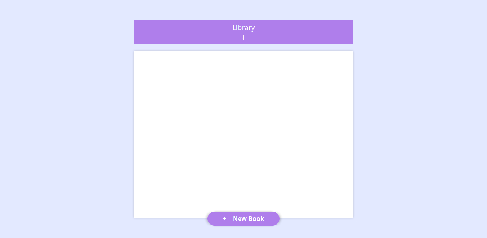

## Table of contents
* [General info](#general-info)
* [Screenshots](#screenshots)
* [Technologies](#technologies)
* [Setup](#setup)
* [Features](#features)
* [Inspiration](#inspiration)

## General info
This project is a simple library for your books, you could add,remove and check wether that you read it or not. you only put the book name,author and pages and then the book will be in your library.
I build this project to sharpen my skills with the objects in Vanilla javaScript.

## Screenshots

## Technologies
This project is created with:-

* HTML
* CSS
* Vanilla javaScript

## Setup
To run this project go to this live preview --> https://htmlpreview.github.io/?https://github.com/sheehaab/Book-Library/blob/master/index.html

## Features

* Add book button
* Read check button

## Inspiration

Project inspired by @TheOdinProject.